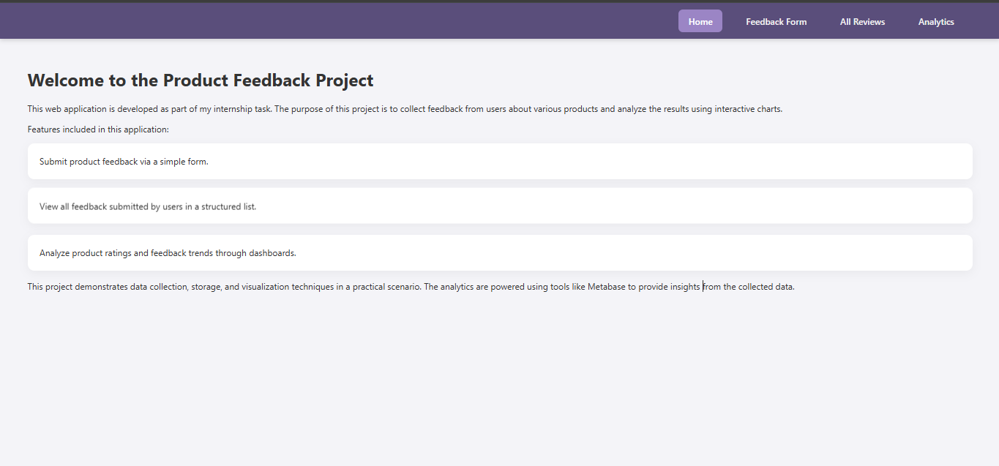
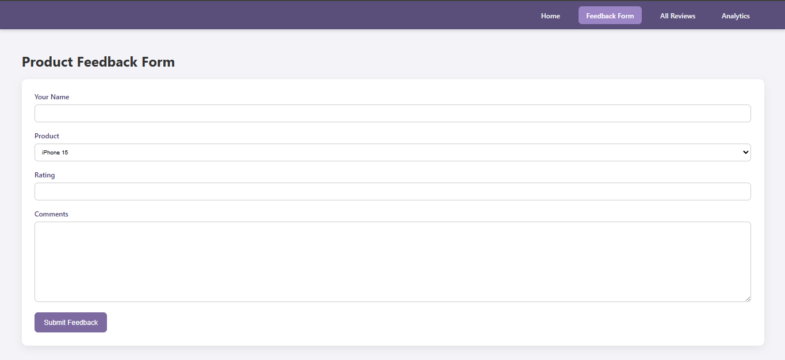
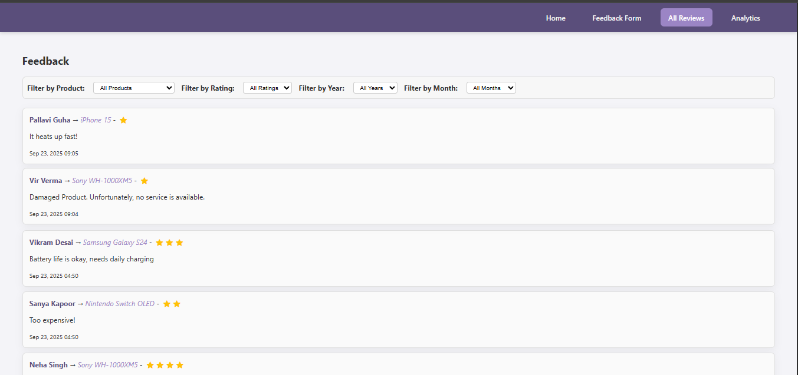

# Internship Django Project

## Project Name

**Internship Project – Feedback & Analytics System**

## Overview

This is a **full-stack web application** built using **Django** (backend + frontend) with a **PostgreSQL database on Supabase**. The project includes a **feedback form**, data storage, and **Metabase dashboards** for analytics visualization. The application is **deployed on Render** and accessible via a public link.

---

## Features

* User-friendly **feedback form** with input validation.
* **Database integration** with Supabase PostgreSQL.
* **Analytics dashboards** embedded using Metabase.
* Secure deployment with **HTTPS**, session, and CSRF protections.
* Responsive and clean frontend with CSS & JavaScript.

---

## Technologies Used

* **Backend:** Django 5.2.6
* **Frontend:** HTML, CSS, JavaScript
* **Database:** Supabase PostgreSQL
* **Analytics:** Metabase (embedded charts)
* **Deployment:** Render

---

## Setup & Installation

1. **Clone the repository**

   ```bash
   git clone https://github.com/Tanushree2004/internship-django
   cd internship_project
   ```

2. **Create a virtual environment**

   ```bash
   python -m venv venv
   source venv/bin/activate   # Linux/macOS
   venv\Scripts\activate      # Windows
   ```

3. **Install dependencies**

   ```bash
   pip install -r requirements.txt
   ```

4. **Environment variables**

   * Create a `.env` file in the project root:

     ```
     DATABASE_URL=your_supabase_database_url
     DJANGO_SECRET_KEY=your_secret_key
     DJANGO_DEBUG=True
     ```

5. **Run migrations**

   ```bash
   python manage.py migrate
   ```

6. **Run the development server**

   ```bash
   python manage.py runserver
   ```

7. **Access the application**
   Open your browser at `http://127.0.0.1:8000/`

---

## Deployment

The project is **deployed on Render**:
[https://internship-django.onrender.com](https://internship-django.onrender.com)

---

## Screenshots





---

## Author

**Tanushree Jati**
